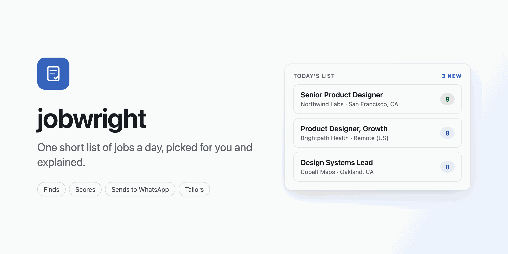
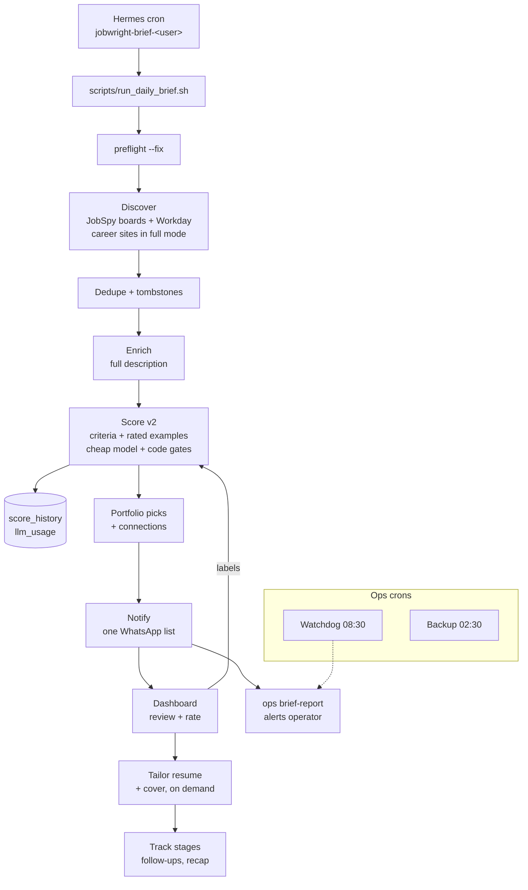
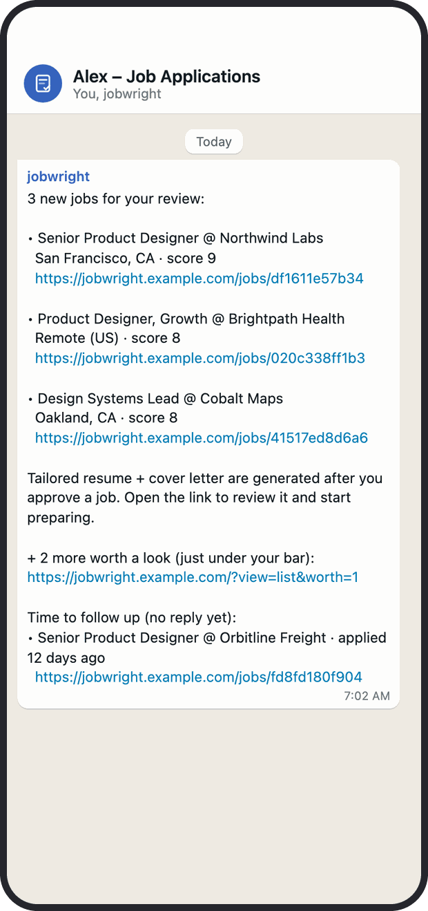
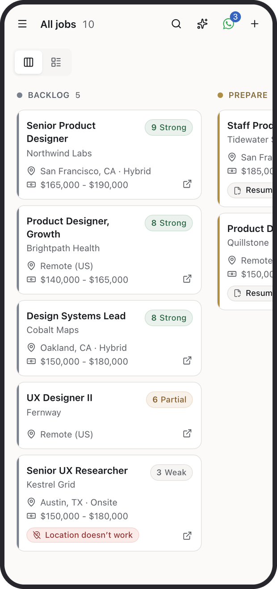
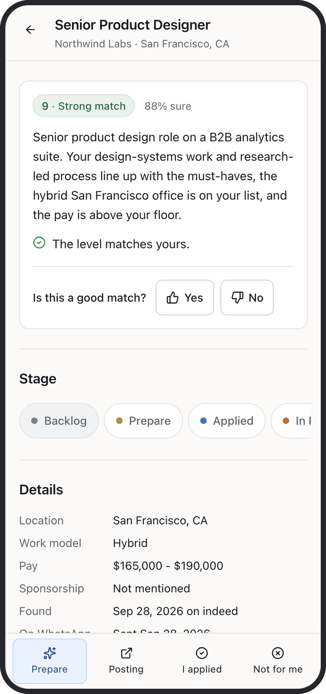
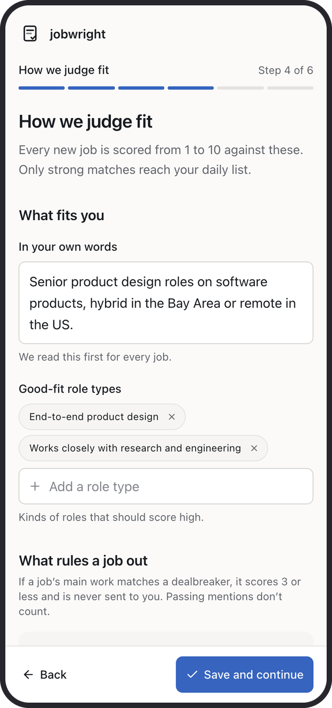
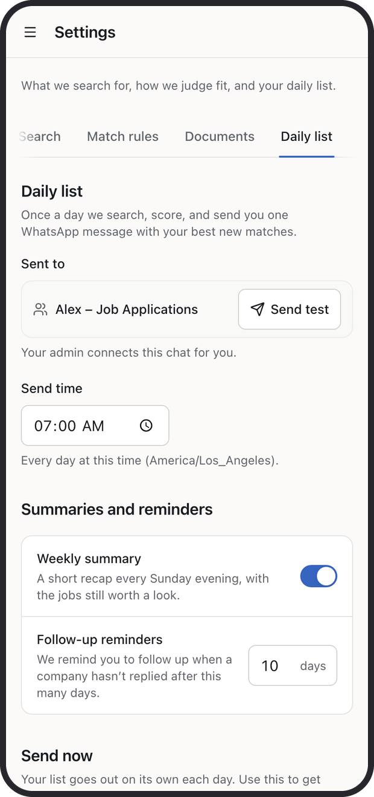
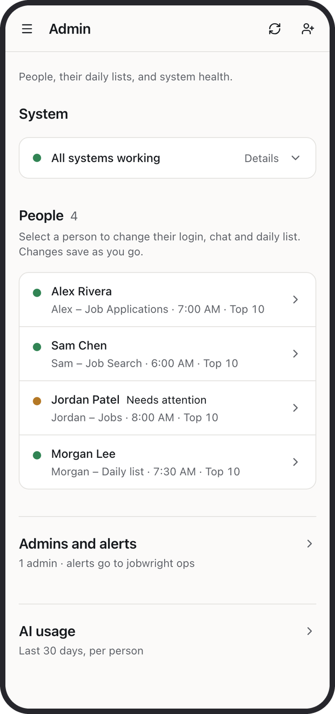

<p align="center"></p>

<p align="center"><b>One short list of jobs a day, picked for you and explained.</b><br>jobwright searches job boards every morning, scores each role against your own rules and past ratings, and sends the best matches to WhatsApp, with a dashboard to review, tailor and track them.</p>

<p align="center"><a href="#try-it-in-5-minutes">Try it</a> · <a href="#install">Install</a> · <a href="#how-it-works">How it works</a> · <a href="#reference">Reference</a></p>

<p align="center"><code>Python 3.11+</code> <code>FastAPI</code> <code>React + Vite</code> <code>SQLite</code> <code>Hermes (WhatsApp)</code> <code>AGPL-3.0</code></p>

---

## Why jobwright

- **You read ten jobs, not five hundred.** Every posting is scored 1 to 10 against your own match rules, and only the ones above your cutoff reach your daily list (default 7+, top 10 for new profiles).
- **Every score comes with a reason.** The job drawer says which rules a job passed or broke, how sure the scorer is, and why. Hard rules (dealbreakers, location, pay floor) are enforced in code, not left to the model.
- **It learns from you.** A thumbs up or down, or "Not for me" with a reason, becomes a labelled example the scorer sees the next time it rates a similar job.
- **Your materials, not invented ones.** Tailored resumes and cover letters are rewritten from your own base resume and examples, exported as DOCX, and a job only gets them when you ask (or every strong match, if you turn review-first off).

## How it works

1. **Set up once.** Upload your resume at `/welcome`. jobwright drafts your searches and match rules from it; you adjust them and pick a time for your daily list.
2. **Every morning it searches and scores.** New postings from job boards and company career portals are deduplicated, enriched with the full description and scored against your rules.
3. **You get one WhatsApp message.** It lists the new jobs that cleared your cutoff, each with a link into the dashboard. No message is sent when nothing new clears the bar.
4. **Review and rate in the dashboard.** Open a job to see the match explanation, rate it, dismiss it, or tap **Prepare** to generate a tailored resume and cover letter.
5. **Apply and track.** Apply with your materials, move the card through Applied, In Progress and Offer, and get follow-up reminders and a Sunday recap.



## Screens

<table>
  <tr>
    <td align="center" width="25%"><br><sub><b>Daily list</b><br>One WhatsApp message with links</sub></td>
    <td align="center" width="25%"><br><sub><b>Board</b><br>Every job as a scored card</sub></td>
    <td align="center" width="25%"><br><sub><b>Job drawer</b><br>Why it matched, rate it, prepare</sub></td>
    <td align="center" width="25%"><br><sub><b>Welcome</b><br>Rules drafted from your resume</sub></td>
  </tr>
  <tr>
    <td align="center" width="25%"><br><sub><b>Settings</b><br>Chat, send time, reminders</sub></td>
    <td align="center" width="25%"><br><sub><b>Admin</b><br>People, chats and system health</sub></td>
    <td width="25%"></td>
    <td width="25%"></td>
  </tr>
</table>

<sub>Captured on a 390 x 844 phone viewport from the built dashboard with fake data (the person "Alex Rivera", made-up companies, example.com links). The WhatsApp image is a rendering of the exact text <code>notify.py</code> builds for those fake jobs. Regenerate with <code>scripts/readme_images.py</code>, see <a href="#reference">Reference</a>.</sub>

## Features

| Feature | What it does |
|---------|--------------|
| Discovery | JobSpy boards (Indeed, LinkedIn, Glassdoor, ZipRecruiter, Google; default Indeed, LinkedIn, ZipRecruiter), 48 preconfigured Workday portals, and 26 direct career sites via smart extract in `DISCOVER_MODE=full` (the daily brief runs `fast`, which skips smart extract) |
| Dedupe and tombstones | A cross-board `dedupe_key` (company, title, place) merges reposts; pruned or duplicate jobs are tombstoned so they never come back |
| Scoring v2 | One structured call per job against your match rules plus the 12 most similar rated jobs; code caps a dealbreaker or bad location at 3, pay below your floor at 4, unknown location at 6 |
| Daily list | One WhatsApp message per day with new jobs above your cutoff, a "worth a look" count just under it, and up to 3 due follow-ups |
| Match explanation and ratings | Score, confidence and reasons per job; thumbs up/down and "Not for me" with reasons become labels for future scoring |
| Match quality | `/quality` shows how often the scorer agreed with you and offers a one-tap cutoff change; `jobwright eval` reports precision and recall |
| Tailored materials | Resume and cover letter per job from your base resume and examples, exported as DOCX (optional PDF); a validator blocks resumes that fail checks |
| Connections | Ranks people from your LinkedIn `Connections.csv` export who are worth contacting at each company |
| Tracking | Kanban lanes Backlog, Prepare, Applied, In Progress, Offer, Closed; follow-up reminders after 10 days (per person); Sunday recap |
| Multi-user | Each login sees only its own profile behind Cloudflare Access; admins add people, connect their WhatsApp chats and see cost per person |
| Ops | Every brief ends with an operator report; a watchdog flags missed briefs; nightly backups of every profile |
| Apply (optional) | A browser agent fills and submits forms. Dry-run unless `--live`, never from cron, LinkedIn blocked |

## Try it in 5 minutes

The shortest path needs no accounts, keys or network access beyond installing packages: the real dashboard UI runs in a browser against the fake data used for the screenshots. Nothing is searched, scored or sent.

> [!NOTE]
> Scoring, tailoring and cover letters need an LLM key (Fireworks by default), and the daily WhatsApp list needs Hermes. There is no secret-free way to run those parts; see [Install](#install) for the full setup.

**Prerequisites:** Python 3.11+, [uv](https://docs.astral.sh/uv/), Node.js 20.19+ with pnpm 9.

```bash
git clone https://github.com/parthchandak02/jobwright.git
cd jobwright
uv sync --extra web --extra dev
(cd frontend && pnpm install --frozen-lockfile && pnpm run build)
uv run playwright install chromium
uv run --extra web --with pillow python scripts/readme_images.py --demo
```

1. A Chromium window opens on the board, signed in as the demo admin "Alex Rivera".
2. Click **Senior Product Designer** at Northwind Labs to open the job drawer and its match explanation.
3. Open the menu for **Settings** (Daily list tab) and **Admin**.
4. Close the window to stop. Edits are not saved anywhere.

Expected terminal output: `Demo running with fake data. Close the browser window to stop.`

To check the code instead, run the test suite (no keys needed, about a minute):

```bash
uv run pytest tests/ -q      # 343 passed
```

## Install

<details>
<summary><b>Job seekers</b></summary>

You don't install anything. The person who runs jobwright (the admin) adds you on the Admin page and connects your WhatsApp group. You open the dashboard link, sign in with the one-time code Cloudflare emails you, and finish the short setup at `/welcome`. What the WhatsApp messages mean and what you can ask: [docs/agents/whatsapp-user-guide.md](docs/agents/whatsapp-user-guide.md).

</details>

<details>
<summary><b>Running it for yourself (CLI)</b></summary>

Needs a Fireworks API key (`FIREWORKS_API_KEY`); Gemini (`GEMINI_API_KEY`) is used as a fallback when set.

```bash
git clone https://github.com/parthchandak02/jobwright.git
cd jobwright
uv sync --extra web --extra dev
cp .env.example .env              # add FIREWORKS_API_KEY
uv run jobwright init             # resume, profile, searches, API keys
uv run jobwright doctor           # what is installed and what is missing
uv run jobwright preflight --fix  # installs the Playwright Chromium the package needs
uv run jobwright run -w 4 --min-score 7
uv run jobwright status
```

Without an LLM key, `jobwright doctor` reports "Tier 1 — Discovery": `jobwright run discover` works, scoring and tailoring do not. With `pip` instead of uv: `pip install -e ".[dev,web]"`.

</details>

<details>
<summary><b>Operators (dashboard, WhatsApp, multi-user)</b></summary>

On top of the CLI setup you need:

| Piece | Needed for | Setup |
|-------|-----------|-------|
| Node.js 20.19+ and pnpm 9 | Dashboard UI | `cd frontend && pnpm install --frozen-lockfile` |
| pm2 or tmux | Running the API and UI | `./scripts/restart.sh` (pm2) or `./scripts/restart.sh --tmux` |
| Hermes + `hermes` CLI with a WhatsApp bridge | Daily list, alerts, welcome message | [docs/agents/hermes-setup.md](docs/agents/hermes-setup.md), [install-hermes-skill.md](docs/agents/install-hermes-skill.md) |
| Cloudflare Tunnel + Access | Hosted multi-user login | `JOBWRIGHT_CF_TEAM_DOMAIN`, `JOBWRIGHT_CF_AUD`; [docs/agents/dashboard-hosting.md](docs/agents/dashboard-hosting.md) |
| `CURSOR_API_KEY`, Chrome, Node.js | Optional browser apply | [docs/agents/cursor-setup.md](docs/agents/cursor-setup.md) |

```bash
cp ecosystem.config.example.js ecosystem.config.js
./scripts/restart.sh --tmux        # local: API :8002 (--reload) + Vite :5120, dev auth, Hermes dry-run
open http://127.0.0.1:5120

./scripts/install_skills.sh        # Hermes/Cursor skill pointer
./scripts/setup_hermes_cron.sh     # copies cron scripts, runs jobwright ops install-crons
```

In `dev` auth mode the dashboard trusts the caller (anonymous admin, or `JOBWRIGHT_DEV_EMAIL`). Production sets `JOBWRIGHT_AUTH_MODE=cloudflare` and serves the built UI from the API on `:8002` without `--reload`.

</details>

## Using it

A normal day for a job seeker:

1. The daily list arrives at your chosen time (new profiles default to 7:00): "3 new jobs for your review", each with a score and a link.
2. Tap a link. The job drawer shows the match explanation. Rate it (**Yes** / **No**) or dismiss it with **Not for me** and a reason.
3. For jobs you want, tap **Prepare**. The tailored resume and cover letter appear in the drawer in a few minutes, as text and DOCX.
4. Apply on the employer's site, tap **I applied**, and move the card along as things happen.
5. After 10 days without a stage change you get a follow-up reminder in the drawer, in the daily list and in the Sunday recap.

> [!TIP]
> Rate about ten jobs in the first days (the board shows a "Rate 10 jobs" banner until you do). Ratings are the fastest way to make the list sharper, and **Match quality** shows whether a different cutoff would suit you better.

## Configuration

**Per profile** (under `users/<id>/`, or `~/.jobwright/` for a single user):

| File | Purpose |
|------|---------|
| `resume/base.pdf` | Source of truth for tailoring; `resume/base.md` is derived from it |
| `profile.json` | Contact info, work authorization, compensation, experience, skills, portfolio projects; start from [profile.example.json](profile.example.json) |
| `profile.json` → `match_criteria` | Dealbreakers, good-fit role types, locations, seniority, pay floor, `notify_threshold`; derived from your preferences until edited (Settings → Match rules, or `jobwright criteria suggest --save`) |
| `searches.yaml` | Queries, locations, boards, title exclusions, min salary |
| `cover-letter/examples/` | Style and tone for cover letters |
| `connections.csv` (optional) | LinkedIn export for per-job connections |

**Registry** `users/users.yaml`: each profile's login `emails`, `whatsapp_target`, `schedule`, `human_gate` (review-first, on for new profiles), `brief_top_n` (10 for new profiles), `weekly_summary`, `followup_days`, `apply_enabled`; top-level `admins` and `ops_target`.

**Environment** (one gitignored `.env` at the repo root, shared by all profiles; full commented list in [.env.example](.env.example)):

| Variable | Default | Role |
|----------|---------|------|
| `FIREWORKS_API_KEY` | none | LLM for score, tailor, cover |
| `LLM_MODEL` | `accounts/fireworks/models/glm-5p3-flash` | Model for every stage |
| `GEMINI_API_KEY`, `GEMINI_FALLBACK_MODEL` | none, `gemini-3.7-flash` | Fallback on empty responses |
| `JOBWRIGHT_SCORE_WORKERS` | 16 | Concurrent scoring calls |
| `JOBWRIGHT_REASONING_T1` | `low` | Reasoning effort for the scoring model |
| `LLM_ESCALATION_MODEL` | off | Opt-in stronger model for borderline jobs |
| `JOBWRIGHT_SCORER` | `v2` | `v1` restores the legacy scorer |
| `JOBWRIGHT_BRIEF_MAX_AGE_DAYS` | 7 | Only jobs discovered this recently are sent |
| `DISCOVER_MODE` | `fast` | `full` adds smart extract of career sites |
| `JOBWRIGHT_AUTH_MODE` | `cloudflare` if `JOBWRIGHT_CF_TEAM_DOMAIN` is set, else `dev` | Dashboard auth |
| `JOBWRIGHT_PUBLIC_BASE_URL` | `https://jobwright.parthchandak.info` | Base of the links in WhatsApp messages |
| `JOBWRIGHT_BACKUP_DIR` | `~/jobwright-backups` | Nightly backups |
| `JOBWRIGHT_HERMES_DRY_RUN` | off | `1` turns cron changes and WhatsApp sends into log lines |

## Safety and security

> [!WARNING]
> Live apply submits real applications, and the daily list, test messages and the one-time welcome are real WhatsApp messages. In any sandbox, worktree or test run set `JOBWRIGHT_HERMES_DRY_RUN=1` (`restart.sh --tmux` does this for you), and never run a brief or `jobwright_smoke.sh` for a real profile without it.

- **Find and prepare only by default.** `jobwright apply` is dry-run unless `--live`; live apply needs `apply_enabled` for the profile and runs only from the dashboard button (with a confirm) or an explicit command, never from cron. Auto-apply to LinkedIn is blocked in code.
- **No invented experience.** Tailoring works only from your base resume; a resume that fails validation is not saved or exported.
- **No silent failures.** Problems (failed preflight or stages, zero scored jobs, notify failure, a brief that never ran) alert the operator's chat, not the job seeker's. If some stages fail, the list still goes out with whatever is ready.
- **Each login sees only its own profile.** Cloudflare Access verifies the login; the API binds the profile per request. Only admins can list or change WhatsApp chats.
- **Never commit** `.env`, `users/`, `~/.jobwright/`, `ecosystem.config.js`, resumes, `connections.csv` or any API token.

## Reference

<details>
<summary><b>Build and test</b></summary>

```bash
uv run pytest tests/ -q                 # full suite
uv run ruff check src tests             # lint
cd frontend && pnpm run build           # type-check + production build into frontend/dist
bash scripts/validate_pipeline.sh       # doctor + unit checks
```

Regenerate the README images (needs `frontend/dist`):

```bash
uv run --extra web --with pillow python scripts/readme_images.py
```

It loads the built UI in headless Chromium, answers every `/api/**` call with the fake fixtures in the script, blocks all other network requests, and writes `docs/images/*.png` (phones 620 px wide including the frame, hero 2400 x 1200, each under 250 KB). `--demo` opens the same setup in a visible window.

</details>

<details>
<summary><b>Pipeline stages</b></summary>

| Stage | Command | What happens |
|-------|---------|--------------|
| 1. Discover | `run discover` | JobSpy boards and Workday portals; smart extract of career sites in `DISCOVER_MODE=full` |
| 2. Enrich | `run enrich` | Full description and apply link (JSON-LD, CSS selectors, or LLM extraction) |
| 3. Score | `run score` | Scoring v2 against match rules and similar rated jobs; code applies the caps |
| 3b. Portfolio | `run portfolio` | Picks the most relevant projects from your profile per job |
| 4. Tailor | `run tailor` | Resume per job from your base resume |
| 5. Cover letter | `run cover` | Cover letter per job from your examples and profile |
| 5a. PDF | `run pdf` | HTML/PDF export |
| 5b. DOCX | `run docx` | Word documents of the resume and cover letter |
| 5c. Connect | `run connect` | Ranks LinkedIn connections per job |
| 6. Apply | `apply` | Browser agent fills and submits forms (optional, gated) |

`jobwright run` with no stages runs the profile's default list. With `human_gate` (review-first, the default for new profiles) that is `discover enrich score portfolio connect`, and materials are made on demand. Without it, every stage 1 to 5c runs, including `pdf`. Explicit stage lists run as given. Runs hold a per-profile lock, so cron, dashboard and CLI never overlap.

</details>

<details>
<summary><b>CLI</b></summary>

Put `--user <id>` before the subcommand: `jobwright --user alex status`.

```bash
jobwright init | doctor | status | dashboard           # setup, health, stats, local HTML snapshot
jobwright --user <id> preflight [--fix] [--json]
jobwright --user <id> run [stages...] -w 4 --min-score 7
jobwright --user <id> tailor-job --url "https://..." [--resume-only | --cover-only]
jobwright --user <id> notify [--dry-run]               # the daily WhatsApp list
jobwright [--user <id>] summary [--dry-run]            # weekly recap
jobwright --user <id> briefstats --days 14
jobwright --user <id> dedupe [--apply]
jobwright --user <id> criteria show | suggest [--save]
jobwright --user <id> labels list | export FILE
jobwright --user <id> eval                             # precision / recall on your ratings
jobwright --user <id> rescore --scope active|labeled|all|since:<days> [--dry-run]
jobwright --user <id> apply [--limit 1]                # dry-run
jobwright --user <id> apply --live --url "https://..." # needs apply_enabled
jobwright users list | add | set
jobwright ops brief-report | watchdog | set-target | backup | install-crons | weekly-eval
jobwright access status | sync [--yes]                 # Cloudflare Access allowlist
jobwright hermes channels [--apply]                    # per-profile WhatsApp group prompts
```

Agent-native JSON wrapper: `./bin/job-apply-pp-cli status --agent --user <id>`. Apply agent provider: `AGENT_PROVIDER=cursor-sdk` (default), `cursor-cli` or `claude`.

</details>

<details>
<summary><b>Scheduled jobs (Hermes crons)</b></summary>

All are created with `--no-agent --deliver local` by `jobwright ops install-crons` (brief crons only for profiles that finished setup) or when a brief time is saved in the dashboard.

| Cron | When | What |
|------|------|------|
| `jobwright-brief-<user>` | The profile's send time (7:00 for new profiles) | `jobwright_brief.sh` → `run_daily_brief.sh`: preflight, default stages, `notify`, `ops brief-report` |
| `jobwright-ops-watchdog` | 08:30 daily | Alerts on briefs that never ran (120 min grace) |
| `jobwright-backup` | 02:30 daily | `jobwright ops backup`: SQLite online backup + rsync snapshots, 14 days kept |
| `jobwright-weekly-eval` | Sunday 17:00 | `jobwright ops weekly-eval`: accuracy check for profiles with 20+ ratings |
| `jobwright-weekly-summary` | Sunday 18:00 | `jobwright summary` for every profile (opt out with `weekly_summary: false`) |

Alerts go to `ops_target` in `users/users.yaml` (`jobwright ops set-target`).

</details>

<details>
<summary><b>Dashboard API</b></summary>

FastAPI under `/api`, full list in [docs/agents/repo-map.md](docs/agents/repo-map.md#dashboard-api-high-level).

| Route | Role |
|-------|------|
| `GET /api/me`, `POST /api/session` | Login, admin flag, openable profiles; switch profile |
| `GET /api/board`, `GET /api/jobs/{id}` | Board lanes; one job (deep link `/jobs/:jobId`) |
| `PATCH /api/jobs/{id}`, `POST /api/jobs/{id}/move`, `POST /api/jobs/{id}/followup` | Rate (appends a label), move stage, follow-up actions |
| `POST /api/run`, `GET /api/stream/{run_id}`, `POST /api/runs/{run_id}/stop` | Auto Search with live logs |
| `POST /api/jobs/{id}/tailor[/resume\|/cover]` | Tailored materials on demand |
| `GET /api/notify/preview`, `POST /api/notify` | Preview or send the daily list |
| `GET/PUT/PATCH /api/criteria` | Match rules; `PATCH` changes only the cutoff |
| `GET /api/quality` | Match quality summary |
| `/api/onboarding/*` | Welcome flow |
| `/api/admin/*` | Admin only |

</details>

<details>
<summary><b>Repo layout</b></summary>

```
jobwright/
├── AGENTS.md                 # agent entry point (Cursor, Claude, Hermes)
├── src/jobwright/            # package: discovery, enrichment, scoring, notify, ops, web API, apply
├── frontend/                 # React dashboard (Vite)
├── scripts/                  # daily brief, Hermes cron installers, restart.sh, readme_images.py
├── templates/hermes-skill/   # thin loader copied to ~/.hermes/skills/
├── bin/job-apply-pp-cli      # agent-native CLI wrapper
├── config/live.env.example   # live-apply env template
├── profile.example.json      # onboarding template
├── tests/
└── docs/                     # docs, ADRs, images
```

Shipped board and site definitions live in `src/jobwright/config/` (`employers.yaml`, `sites.yaml`, `searches.example.yaml`).

</details>

## Docs and contributing

| Doc | For |
|-----|-----|
| [AGENTS.md](AGENTS.md) | Agents and engineers: end-to-end flow, commands, rules |
| [docs/agents/whatsapp-user-guide.md](docs/agents/whatsapp-user-guide.md) | Job seekers: the WhatsApp side |
| [docs/agents/hermes-operator-guide.md](docs/agents/hermes-operator-guide.md) | Operators: Hermes and WhatsApp operations |
| [docs/agents/hermes-setup.md](docs/agents/hermes-setup.md) | Cron and script setup |
| [docs/agents/dashboard-hosting.md](docs/agents/dashboard-hosting.md) | Dashboard hosting, auth and app surfaces |
| [docs/agents/repo-map.md](docs/agents/repo-map.md) | Paths, scripts, API and environment |
| [docs/adr/](docs/adr/) | Architecture decisions (multi-user auth, scoring v2, ops) |
| [docs/CONTRIBUTING.md](docs/CONTRIBUTING.md) | How to contribute |
| [docs/CHANGELOG.md](docs/CHANGELOG.md) | Release notes |
| [docs/GLOSSARY.md](docs/GLOSSARY.md) | Terms |
| [docs/README.md](docs/README.md) | Index of all docs |

Maintained by [@parthchandak02](https://github.com/parthchandak02). Issues and pull requests are welcome on GitHub.

## License

jobwright is licensed under the [GNU Affero General Public License v3.0](LICENSE). If you deploy a modified version as a service, you must release your source under the same license. Portions of the pipeline come from an earlier AGPL-3.0 codebase; that attribution is kept in [docs/UPSTREAM.md](docs/UPSTREAM.md).
